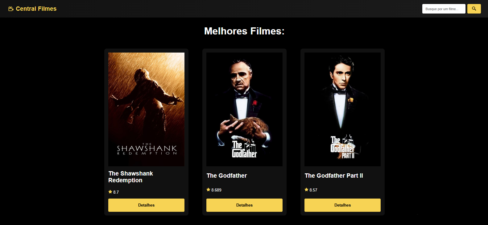

# Central Filmes



Site de filmes utilizando a API do [TMDB](https://www.themoviedb.org/), construído com [React](https://reactjs.org/) e [Vite](https://vitejs.dev/).

## Descrição

Este projeto é um site de listagem e busca de filmes, que consome a API do TMDB para exibir detalhes como título, pôster, sinopse, data de lançamento, entre outros. O usuário pode navegar entre as páginas de filmes populares, filmes em cartaz e realizar buscas por títulos específicos.

---

## Tecnologias Utilizadas

-   **React** 
-   **TMDB API** (API de dados de filmes e séries)

## Configuração do Ambiente

1.  **Clonar o repositório**:

    ```bash
    git clone https://github.com/LucasBatista37/Central-Filmes.git
    ```

2.  **Instalar dependências**:

    ```bash
    npm install
    # ou
    yarn install
    ```

3.  **Variáveis de ambiente**:
    Crie um arquivo `.env` na raiz do projeto seguindo o modelo abaixo:

    ```plaintext
    VITE_API_KEY=
    VITE_API=
    VITE_SEARCH=
    VITE_IMG=
    ```

    -   `VITE_API_KEY`: Chave de acesso para a API do TMDB (coloque a **sua própria** API Key obtida no site do TMDB).
    -   `VITE_API`: Endpoint base para acessar recursos de filmes (por exemplo, filmes populares).
    -   `VITE_SEARCH`: Endpoint para realizar buscas por filmes.
    -   `VITE_IMG`: URL base para as imagens de pôster de filmes.

## Obtendo Sua Própria API Key

Para utilizar a API do TMDB em produção, crie a sua própria conta e obter uma chave de API:

1.  Acesse [The Movie Database (TMDB)](https://www.themoviedb.org/).
2.  Crie uma conta ou faça login, se já tiver.
3.  Vá em **Settings** (Configurações) e em seguida **API**.
4.  Gere sua **API Key** e atualize o valor em `VITE_API_KEY` do seu arquivo `.env`.

---

## Executando o Projeto

### Ambiente de Desenvolvimento

Após instalar as dependências e configurar o `.env`, basta rodar:

```bash
npm run dev
# ou
yarn dev
```

Normalmente o Vite abrirá automaticamente no navegador em [http://localhost:5173](/) (ou em alguma outra porta).

### Rodando o Servidor de Pré-visualização

Se quiser testar localmente o projeto já compilado, execute:

```bash
npm run preview
# ou
yarn preview
```
---

## Licença

Este projeto está licenciado sob a [MIT License](https://chatgpt.com/c/LICENSE). Sinta-se livre para usar, modificar e distribuir à vontade.

---

## Contato

-   [Lucas Batista](https://github.com/LucasBatista37)
-   [LinkedIn](https://www.linkedin.com/in/lucas-batista-004212263)